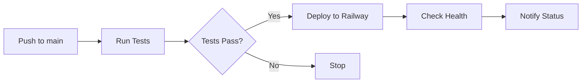
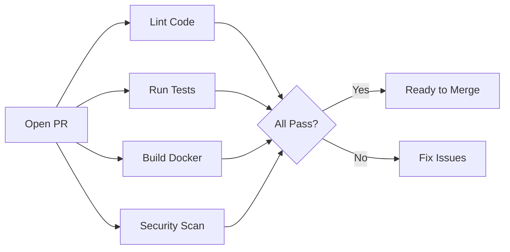

# CI/CD Setup Guide

## Overview
This project uses GitHub Actions for continuous integration and deployment to Railway.

## Workflows

### 1. Railway Deploy (`railway-deploy.yml`)
- **Trigger**: Push to main branch
- **Actions**:
  - Run tests
  - Deploy to Railway
  - Check deployment health
- **Required Secret**: `RAILWAY_TOKEN`

### 2. PR Checks (`pr-checks.yml`)
- **Trigger**: Pull request events
- **Actions**:
  - Lint code (Python & JavaScript)
  - Run tests with PostgreSQL and Redis
  - Test Docker build
  - Security scanning
- **No secrets required**

### 3. Claude Code Review (`claude-code-review.yml`)
- **Trigger**: Pull requests
- **Actions**: AI-powered code review
- **Required Secret**: `ANTHROPIC_API_KEY`

### 4. E2E Tests (`e2e-tests.yml`)
- **Trigger**: Manual or scheduled
- **Actions**: End-to-end testing
- **Status**: To be configured

## Setup Instructions

### Step 1: Get Railway Token
1. Go to Railway dashboard
2. Click on your profile → Account Settings
3. Go to "Tokens" tab
4. Create new token with name "GitHub Actions"
5. Copy the token

### Step 2: Add GitHub Secrets
1. Go to your GitHub repository
2. Settings → Secrets and variables → Actions
3. Add the following secrets:

```yaml
RAILWAY_TOKEN: your-railway-token-here
ANTHROPIC_API_KEY: your-claude-api-key (optional)
```

### Step 3: Configure Branch Protection
1. Go to Settings → Branches
2. Add rule for `main` branch
3. Enable:
   - Require pull request reviews
   - Require status checks to pass
   - Require branches to be up to date
   - Include administrators

### Step 4: Test Workflows
```bash
# Test locally with act
brew install act
act -l  # List workflows
act push -W .github/workflows/railway-deploy.yml  # Test deploy workflow
```

## Workflow Details

### Railway Deploy Workflow


### PR Checks Workflow


## Environment Variables

### Required for CI/CD
```env
# GitHub Secrets
RAILWAY_TOKEN=your-railway-token

# Railway Environment (set in Railway dashboard)
DATABASE_URL=auto-provided
REDIS_URL=from-redis-service
SECRET_KEY=generated-key
TELEGRAM_BOT_TOKEN=your-bot-token
DEBUG=False
```

## Best Practices

### 1. Commit Messages
Use conventional commits:
```
feat: add new feature
fix: resolve bug
docs: update documentation
test: add tests
chore: maintenance tasks
```

### 2. Pull Request Template
Create `.github/pull_request_template.md`:
```markdown
## Description
Brief description of changes

## Type of Change
- [ ] Bug fix
- [ ] New feature
- [ ] Breaking change
- [ ] Documentation update

## Testing
- [ ] Tests pass locally
- [ ] Added new tests
- [ ] Updated documentation

## Checklist
- [ ] Code follows style guidelines
- [ ] Self-review completed
- [ ] No sensitive data exposed
```

### 3. Branch Strategy
```
main (production)
  ├── develop (staging)
  │   ├── feature/feature-name
  │   ├── fix/bug-description
  │   └── chore/task-name
  └── hotfix/urgent-fix
```

## Monitoring

### GitHub Actions Dashboard
- View at: `https://github.com/[user]/[repo]/actions`
- Monitor workflow runs
- Check deployment status
- View logs and artifacts

### Railway Dashboard
- View at: `https://railway.app/project/[project-id]`
- Monitor deployments
- Check logs
- View metrics

## Troubleshooting

### Common Issues

#### 1. Railway Token Invalid
```
Error: Invalid Railway token
Solution: Regenerate token and update GitHub secret
```

#### 2. Tests Failing in CI
```
Error: Tests pass locally but fail in CI
Solution: Check DATABASE_URL and REDIS_URL in workflow
```

#### 3. Docker Build Timeout
```
Error: Build exceeds time limit
Solution: Optimize Dockerfile or increase timeout
```

#### 4. Deployment Health Check Fails
```
Error: Health endpoint not responding
Solution: Check PORT binding and startup logs
```

### Debug Commands
```bash
# Re-run failed workflow
gh workflow run railway-deploy.yml

# View workflow logs
gh run list
gh run view [run-id]

# Download artifacts
gh run download [run-id]
```

## Security Considerations

### Secrets Management
- Never commit secrets to repository
- Use GitHub Secrets for sensitive data
- Rotate tokens regularly
- Use environment-specific secrets

### Security Scanning
- Trivy scans for vulnerabilities
- TruffleHog checks for leaked secrets
- Dependabot updates dependencies
- CodeQL analyzes code security

## Cost Optimization

### GitHub Actions
- Free for public repos
- 2,000 minutes/month for private repos
- Use workflow conditions to limit runs
- Cache dependencies to reduce build time

### Railway
- Free tier includes $5/month credits
- Monitor usage in dashboard
- Use sleep/wake schedules for dev environments
- Optimize resource allocation

## Future Enhancements

### Planned Improvements
1. Add staging environment workflow
2. Implement blue-green deployments
3. Add performance testing
4. Set up dependency updates
5. Add release automation

### Advanced Features
- Rollback on failure
- Canary deployments
- A/B testing support
- Automated backups
- Multi-region deployment

## Support

For CI/CD issues:
1. Check workflow logs in GitHub Actions
2. Review Railway deployment logs
3. Consult this documentation
4. Contact development team

## License
Part of Cvety.kz system - Proprietary